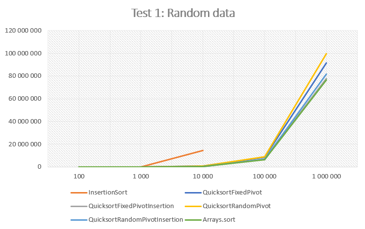
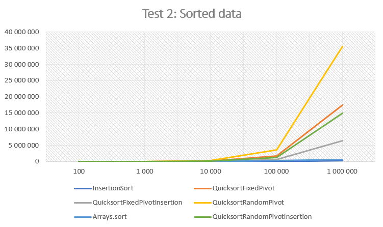
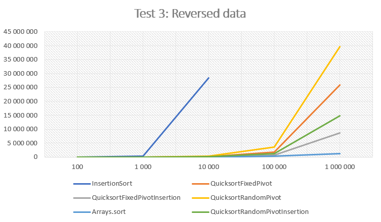
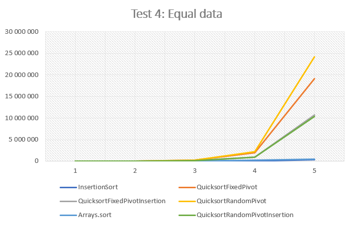

# A Study of Quicksort

William Berg  
INDA-11  
2020

## Characteristics and Complexity

The quicksorting algorithm was developed by C.A.R. Hoare in 1959 while he was studying at the Moscow State University. The idea for the algorithm came to him whilst he was trying to solve a machine translation problem from Russian to English. At the time however, he did not manage to represent his idea in code, that would happen two years later in 1961 after attending a class learning the programming language ALGOL, that allowed for the use of recursion. This enabled him to develop the algorithm recursively - which is the main characteristic of quicksort; it is a recursive sorting algorithm. 

Other than recursion, there are some main properties of quicksort that are worth discussing. It implements the divide and conquer technique (which is not unique to quicksort per se), which is all about dividing the problem into smaller subproblems. In the case of sorting an array of integers, quicksort divides the array into smaller subarrays around the so called pivot element. This is done in a manner so that every element bigger than the pivot is placed to the right of the pivot and every element smaller than the pivot is placed to the left. This method is then repeated on the smaller subarrays with the help of recursion until all the subarrays are sorted. This operation is the core of quicksort and is called partitioning. All of the different implementations of the algorithm do this, but in different ways. The implementation of the partitioning method is the main thing that differs from different variations, and is ultimately what decides the efficiency of the sort. If an appropriate pivot is chosen the sort is expected to run in O(nlogn) time, but if the worst is to happen and the pivot is either the smalles or the largest element, the sort will run in worst-case time complexity, O(n2).  

## Variations of Quicksort

Four quicksort variations were implemented for this task: 
1. A quicksort with a fixed pivot (chosen to be the middle element in the list). This was designed so that the pivot element will always be the middle element in the list, something that assures very good performance for an already sorted array where it actually results in the best case scenario. It uses the partitioning routine of going through the subarrays with two pointers that start at the start and the end of the array respectively. Then the two pointers move towards each other until an element is found on each side that does not belong there. When this happens the elements are promptly swapped. Doing this repeatadly will end you up with a partitioned array. In essence, elements bigger than the pivot are switched with elements smaller than the pivot until the partitioning is complete. This is what the partitioning method looks like: 
~~~
public static int hPartition(int[] array, int start, int end, int pivot) {
        int i = start - 1;
        int j = end + 1;
        while (true) {
            do {
                i = i +1;
            } while (array[i] < pivot);
            do {
                j = j -1;
            } while (array[j] > pivot);
            if (i < j) {
                arraySwap(array, i, j);
            } else {
                return j;
            }
        }
    }
~~~
2. Quicksort with a random pivot (chosen to be any element in the subarray). This implemntation of the algorithm is very similar to the first one, except the process of picking the pivot. In this case the pivot is chosen to be a random element in the subarray. This is very effective in avoiding the worst-case scenario. The partitioning is done a little differently this time, with the pivot argument for the partitioning method instead being a bounded random number (rather than the middle element): 
~~~
private void quicksort(int[] array, int start, int end) {
        if (start < end) {
            int randomIndex = r.nextInt(end - start) + start;
            int i = Partition.hPartition(array, start, end, array[randomIndex]);
            quicksort(array, start, i);
            quicksort(array, i+1, end);
        }
    }
~~~
3. Quicksort with a random pivot and cutoff to insertion sort. This one is identical to the quicksort with a random pivot with the only difference being the cutoff to insertion sort for smaller subarrays of lengths smaller than 20. This particular length was determined through research and benchmarking. The cutoff to insertion sort is done since insertion sort is faster for smaller arrays. 
4. Quicksort with a fixed pivot and cutoff to insertion sort. This variation of quicksort is identical to the one with a fixed pivot, except for the fact that this algorithm cuts off to insertion sort for smaller subarrays. 

## Methodology

Each quicksort variation along with the insertion sort implementation, was tested with different sizes of arrays ranging from a problem size of 100 to 1 million. The insertion sort only has results documented for sizes up to 10,000 for two of the tests, as the time taken until completion is very high for big arrays. The tests were performed with help from the TimingExample class along with the Stopwatch class for measurements. To calculate the average time, the first two results were ignored (because they seemed most anomolous) along with the calculated maximum and minimum values. Removing most of the extreme cases resulted in a more accurate result.  
## Results

Below are all of the testing results. The x-axis on the graphs depicts the problem size (the size of the array), while the y-axis depicts the average time taken to sort in nanoseconds.  
## Test 1: Random data 
| Problem   size  | InsertionSort | QuicksortFixedPivot | QuicksortFixedPivotInsertion | QuicksortRandomPivot  | QuicksortRandomPivotInsertion | Arrays.sort |
|-----------------|---------------|---------------------|------------------------------|-----------------------|-------------------------------|-------------|
| 100             | 5 201         | 2 310               | 2 266                        | 7 156                 | 3 814                         | 5 429       |
| 1 000           | 164 027       | 44 682              | 33 251                       | 67 003                | 48 826                        | 34 193      |
| 10 000          | 14 445 728    | 740 209             | 566 865                      | 812 088               | 584 499                       | 463 785     |
| 100 000         |               | 8 517 192           | 7 036 069                    | 8 943 031             | 6 935 002                     | 6 528 007   |
| 1 000 000       |               | 91 574 422          | 77 790 466                   | 99 687 576            | 81 472 564                    | 76 694 297  |

## Test 2: Sorted data 
| Problem   size  | InsertionSort | QuicksortFixedPivot | QuicksortFixedPivotInsertion | QuicksortRandomPivot  | QuicksortRandomPivotInsertion | Arrays.sort |
|-----------------|---------------|---------------------|------------------------------|-----------------------|-------------------------------|-------------|
| 100             | 950           | 1 936               | 1 270                        | 4 920                 | 2 111                         | 1 317       |
| 1 000           | 2 770         | 11 141              | 6 150                        | 36 240                | 12 076                        | 3 167       |
| 10 000          | 4 646         | 165 883             | 43 669                       | 373 393               | 126 522                       | 28 475      |
| 100 000         | 29 111        | 1 721 720           | 586 389                      | 3 632 955             | 1 133 092                     | 273 608     |
| 1 000 000       | 283 947       | 17 456 964          | 6 447 693                    | 35 549 877            | 13 544 265                    | 687 027     |

## Test 3: Reversed data 
| Problem   size  | InsertionSort | QuicksortFixedPivot | QuicksortFixedPivotInsertion | QuicksortRandomPivot  | QuicksortRandomPivotInsertion | Arrays.sort |
|-----------------|---------------|---------------------|------------------------------|-----------------------|-------------------------------|-------------|
| 100             | 7 375         | 2 074               | 1 344                        | 4 455                 | 2 282                         | 2 929       |
| 1 000           | 310 341       | 13 635              | 6 343                        | 36 687                | 13 781                        | 11 681      |
| 10 000          | 28 445 822    | 196 078             | 52 608                       | 393 907               | 117 999                       | 28 780      |
| 100 000         |               | 1 721 782           | 758 104                      | 3 604 985             | 1 253 098                     | 301 306     |
| 1 000 000       |               | 25 794 211          | 8 689 697                    | 39 595 954            | 14 900 308                    | 1 307 373   |

## Test 4: Equal data 
| Problem   size  | InsertionSort | QuicksortFixedPivot | QuicksortFixedPivotInsertion | QuicksortRandomPivot  | QuicksortRandomPivotInsertion | Arrays.sort |
|-----------------|---------------|---------------------|------------------------------|-----------------------|-------------------------------|-------------|
| 100             | 1 126         | 1 852               | 1 409                        | 2 811                 | 1 758                         | 1 066       |
| 1 000           | 2 770         | 16 875              | 7 088                        | 24 148                | 6 655                         | 2 790       |
| 10 000          | 4 792         | 174 806             | 70 960                       | 221 217               | 76 076                        | 20 612      |
| 100 000         | 25 354        | 1 906 743           | 889 704                      | 2 220 291             | 866 959                       | 227 853     |
| 1 000 000       | 303 858       | 19 145 098          | 10 658 360                   | 24 171 867            | 10 373 381                    | 470 789     |

## Discussion

There are some recurring trends to consider when looking at this data. Firts of all, it seems that the QuiksortRandomPivot variation of the general quicksort algorithm is slowest across the board for all tests. The difference seems to be the most significant when sorting an array that is either already sorted (ascending) or reversed (descending). This is mostly due to the fact that the fixed pivot is always chosen to be the middle element of the array - resulting in the best case scenario (regarding the choice of pivot) for the variations that implement a fixed pivot. Another general observation that can be made based on the results is the fact that the cutoff to insertion sort seems to be highly effective in terms of efficient osrting; as we can cleary see that the two quicksort variations that implements this outperform their counterparts quite significantly. Other than that, it is apparent that the built in quicksort implementation Arrays.sort is considerably faster than the other implementations for large arrays. This holds true for all of the tests except for test 1, when the array is randomly sorted. This indicates that the Arrays.sort algorithm has been optimized to handle the edge cases with equal, reversed and sorted data very well, as when it comes to sorted data, the difference is not as apparent. In fact, all of the quicksort variations display a similar performance when only looking at the sorting of random arrays. The implementation that seems to display results closest to that of Arrays.sort is QuicksortFixedPivotInsertion.  

What could be considered surprising with these results, is the impact that the cutoff to insertion sort has on the performance of the sort. More notably, the difference in sorting speed between QuicksortFixedPivot and QuicksortRandomPivotInsertion in test 2. Even though they are very close in performance, the variation that incorporated a cutoff to insertion sort (with a random pivot) is still faster than the one with a fixed pivot in the middle. This is surprising since it indicates that the cutoff to insertion sort is more important to the efficiency of the sort than picking the perfect pivot (which is the middle element for a sorted array). 
There were some things that turned out much like expected however. Insertion sort was obviously slower than the quicksort variations in test 1 and 3, as it was quite expectedly faster than quicksort for the sorted and the equal array in test 2 and 4. The insane exponential growth for insertion sort for reversed data is also obvious, considering that this is the worst case scenario for that sort. It also shouldn't come as a surprise that the fixed pivot sorts mostly outperformed the random pivot sorts for ascending and descending arrays. 
