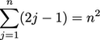

### Deadline:
This work should be completed before the exercise on **Tuesday 21st January**.

### Instructions
For instructions on how to do and submit the assignment, please see the
[assignments section of the course instructions](https://gits-15.sys.kth.se/inda-19/course-instructions#assignments).

### Homework
Study all the following course literature:

* _Objects first with Java 5th ed (6th ed)_: Chapter 8 (Chapter 10) Improving
  Structure with Inheritance
  - Parenthesized chapter/exercise numbers are for the 6th edition, while those
  without are for the 5th.
* [Loop Invariants Explained](https://yourbasic.org/algorithms/loop-invariants-explained/)
* [Induction and Recursive Functions](https://yourbasic.org/algorithms/induction-recursive-functions/)
* [Time Complexity for Recursive Functions](https://yourbasic.org/algorithms/time-complexity-recursive-functions/)

### Github Task
* Complete exercises 8.12 and 8.14 -- 8.16 (10.12 and 10.14 -- 10.16)
* Complete exercise 8.XX

Please commit any Java code developed to the [`src`](src) folder and any
written answers to the [`docs`](docs) folder.

#### Exercise 8.12 (10.12)
Assume that we have four classes: `Person`, `Teacher`, `Student`, and
`PhDStudent`. `Teacher` and `Student` are both subclasses of `Person`.
`PhDStudent` is a subclass of `Student`.

a. Which of the following assignments are legal, and why or why not?

```java
Person p1 = new Student();
Person p2 = new PhDStudent();
PhDStudent phd1 = new Student();
Teacher t1 = new Person();
Student s1 = new PhDStudent();
```

b. Suppose that we have the following legal declarations and assignments:

```java
Person p1 = new Person();
Person p2 = new Person();
PhDStudent phd1 = new PhDStudent();
Teacher t1 = new Teacher();
Student s1 = new Student();
```

Based on those just mentioned, which of the following assignments are legal,
and why or why not?

```java
s1 = p1;
s1 = p2;
p1 = s1;
t1 = s1;
s1 = phd1;
phd1 = s1;
```

#### Exercise 8.14 (10.14)
What has to change in the `NewsFeed` class when another `Post` subclass (for
example, a class `EventPost`) is added? Why?

#### Exercise 8.16 (10.16)
Go back to the lab-classes project from Chapter 1. Add instructors to the
project (every lab class can have many students and a single instructor). Use
inheritance to avoid code duplication between students and instructors (both
have a name, contact details, etc.).

### Induction Exercises

#### Exercise I.1

Using proof by induction, prove the following statements (assume _n_ is a natural number).

(1) 

(2) 

> **Assistant's note:** You may wish to solve these exercises by using paper (then taking a picture of your proof, or by practicing using LaTeX to generate more complex math equations. The following sourcecode may help)

```latex
(1) $$\sum_{i=1}^{n} i^2 = \frac{n(n+1)(2n+1)}{6}$$
(2) $$\sum_{j=1}^{n} (2j-1) = n^2$$

```

#### Exercise I.2
Below are two algorithms that calculate x<sup>n</sup>, where x is a real number
and n is a non-negative integer. You are to:

**a.** Argue the correctness of the algorithms using a loop invariant or proof
by induction.

**b.** Calculate the time-complexity as a function of n for both algorithms.
Give the result using Big-O notation.

```java
double expIterative(double x, int n) {
    double res = 1.0;

    for (int i = 0; i < n; i++) {
        res *= x;
    }
    return res;
}
```
> **Assistant's note:** Try to find a correlation between the loop counter `i`
> and the `res` variable. A loop invariant is most appropriate for this
> algorithm.

```java
double expRecursive(double x, int n) {
    if (n <= 4) {
        return expIterativ(x, n);
    }

    return expRecursive(x, n/2) *
           expRecursive(x, (n + 1)/2);
}
```
> **Assistant's note:** Even if you haven't managed to complete the previous
> proof, assume that `expIterative(x, n)` has been proven to be correct for any
> x &#8712; **R** and `n >= 0`. Furthermore, remember that integer divison
> always rounds off toward 0, and consider the two cases when `n` is odd and
> when `n` is even.  A proof by induction is most appropriate for this
> algorithm.
